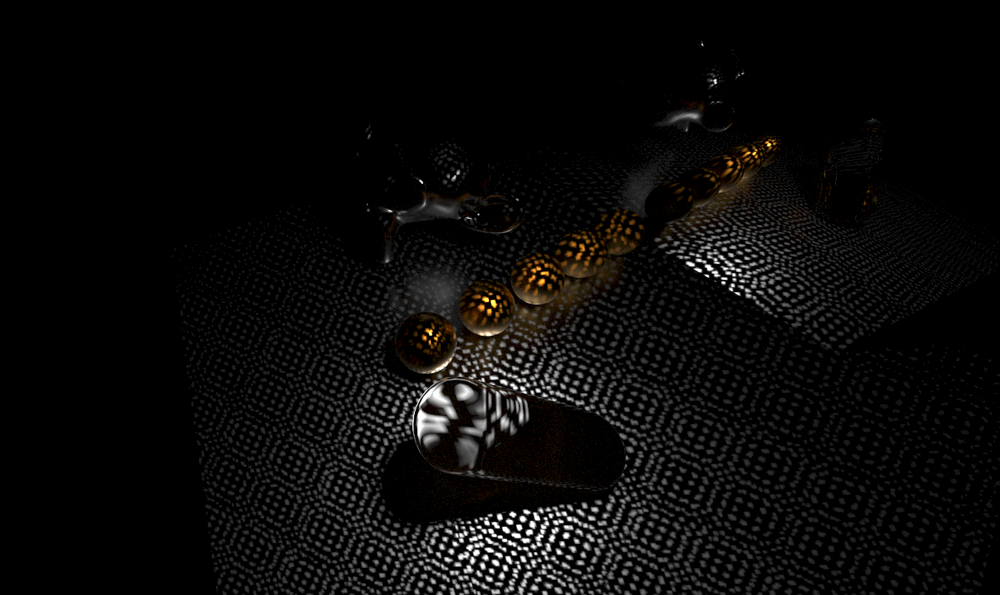

# Kuafu: A Real-Time Ray Tracing Renderer

Kuafu is real-time ray tracing renderer implemented using Vulkan. Kuafu supports physically based materials (PrincipledBSDF) and various realistic light settings. The project is developed as a rendering backend for the high-performance simulator [SAPIEN](https://sapien.ucsd.edu/). It can also serve as a standalone renderer / scene builder.


The name [Kuafu](https://en.wikipedia.org/wiki/Kuafu) ([夸父](https://zh.wikipedia.org/wiki/%E5%A4%B8%E7%88%B6)) is from the Chinese mythology Kuafu chasing the Sun (夸父追日).

*New: Active Light Sensing Support Now Added*

Kuafu now features full active light sensing support. A Demo simulating Intel RealSense D415:



# Compilation

TODO

# Examples

```bash
mkdir build && cd build && cmake .. && make kuafu_example -j && ./kuafu_example;
```


# Features & TODOs

- Physically based materials (PrincipledBSDF / Disney PBR)
  - [x] Diffuse
    - [x] Diffuse texture
  - [x] Specular
    - [ ] Specular texture
  - [x] Roughness
    - [ ] Oren–Nayar reflectance
    - [ ] Roughness Metallic texture
  - [x] Transmission
    - [ ] Refraction w/ roughness
    - [ ] Caustics 
    - [ ] Align behavior with Blender
    - [ ] Beer's Law & Fresnel
  - [x] Emission
    - [ ] Align behavior with Blender
  - [ ] Check numerical issues
  - [ ] Normals texture
    

- Realistic Lights
  - [x] Directional Light (Sun / Distant)
  - [x] Point Light
  - [x] Spot Light
  - [x] Active Light
  - [x] Area Light
    - [ ] Shadow ray traced area light
  - [x] Environment Map
    - [ ] Load from images

    
- Pipeline
  - [x] Image download
    - [ ] Lazy image downloads
    - [ ] Fix validation error when downloading
  - [ ] Async rendering
  - [ ] Separate scene from Renderer
  - [ ] Depth download
  - [ ] Segmentation download
  - [ ] Offscreen rendering
  - [x] Online shader compilation
    - [ ] (Maybe) Use libgls


- Import / Export
  - [x] Assimp scene loader
  - [ ] Embedded materials
  - [ ] Async loading
  - [x] Load full glTF
    - [x] Check with blender glTF
      - Note: Blender (2.93) does not export Specular, IOR and Transmission
  - [ ] Load `.blend`
  - [ ] Check `.obj` appearance with blender
  - [ ] Look into incorrect shadow of "tennis"


- Viewer
  - [ ] Improve mouse control
  - [ ] Fix segfault / vk Exceptions when resizing in SAPIEN


# Acknowledgement

This project itself is licensed under the MIT License. A large portion of code in this repository is derived from open source projects e.g. [Rayex](https://github.com/chillpert/rayex), [vkCore](https://github.com/chillpert/vkCore) and [vk_raytracing_tutorial_KHR](https://github.com/nvpro-samples/vk_raytracing_tutorial_KHR). Please DO NOT remove license information in the headers. We sincerely thank [Christian Hilpert](https://github.com/chillpert) for their substantial work on Rayex, which is the cornerstone of this project.

