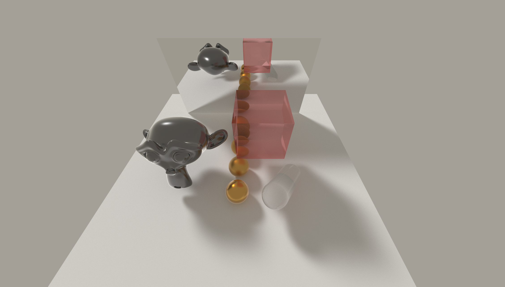

# Kuafu: A Real-Time Ray Tracing Renderer

Kuafu is real-time ray tracing renderer implemented using Vulkan. Kuafu supports physically based materials (PrincipledBSDF) and various realistic lighting models. The project is developed as a rendering backend for the high-performance simulator [SAPIEN](https://sapien.ucsd.edu/).



The name [Kuafu](https://en.wikipedia.org/wiki/Kuafu) ([夸父](https://zh.wikipedia.org/wiki/%E5%A4%B8%E7%88%B6)) is from the Chinese mythology Kuafu chasing the Sun (夸父追日).

# Compilation

TODO

# Examples

```bash
mkdir build && cd build && cmake .. && make example -j && ./example;
```

# Acknowledgement

This project itself is licensed under the MIT License. A large portion of code in this repository is derived from open source projects e.g. [Rayex](https://github.com/chillpert/rayex), [vkCore](https://github.com/chillpert/vkCore) and [vk_raytracing_tutorial_KHR](https://github.com/nvpro-samples/vk_raytracing_tutorial_KHR). Please DO NOT remove license information in the headers. We sincerely thank [Christian Hilpert](https://github.com/chillpert) for their substantial work on Rayex, which is the cornerstone of this project.

